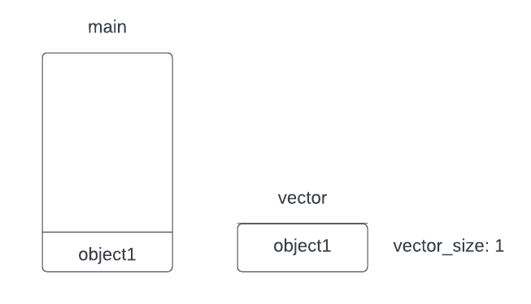
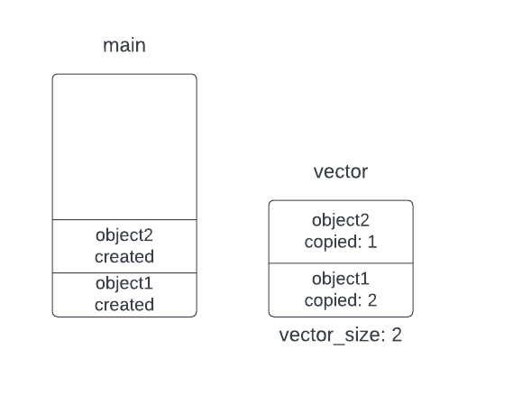
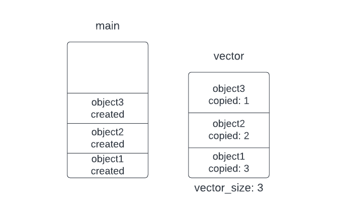

## Optimizing std::vector in C++

Keep in mind that it is easy to write a code but it is not easy to optimize it.

Sone times we write a code and we just keep writing without giving any importance to the memory we use. And this become vere wastage of memory and CPU time also.

We have a struct called ```programmer```

```cpp
struct Programmer
{
    int m_x;
    int m_y;
    Programmer(int x, int y) : m_x(x), m_y(y)
    {std::cout << "______CREATED______" << std::endl;}

    Programmer(const Programmer &prog) : m_x(prog.m_x), m_y(prog.m_y)
    {std::cout << "COPYYYYY" << std::endl;}
};
```

See this code in ```main``` function.

```cpp
std::vector<Programmer> p;
std::cout << p.capacity() << std::endl;
p.push_back(Programmer(1, 2));
p.push_back(Programmer(1, 2));
p.push_back(Programmer(1, 2));
std::cout << p.capacity() << std::endl;
```

Here, there is a disaster because we keep copying the data. Keep in mind that the data is first created in the main and then copied to its place in the vector. And keep in mind another thing: the vector p initially can hold only one object, so when we insert the first object, it is ok, no problem, but the problem in the second insert is that the vector needs to be resized so that it can carry two objects, and this resizing process requires the copying of the data, i.e., there is another call to the copying constructor. And so on.


So after the first push, the main stack and the vector will be like that.

<p align="center">

Note that the object in the main is a result of ```creating```, but the object in the vector is a result of ```copying```.

When we try to push the next object, the vector needs to be resized to be of size 2 so that it can carry the two objects. So that there will be a ```copying``` process, and before that, there will be a ```creating``` process in the main's stack besides a ```copying``` process in the vector. So after the second push, that will happen.

<p align="center">

The third push will result in another expanding process so that the vehicle can carry the third object because it can now carry only two. And this expansion will result in 2 ```copying```, but before it, there will be a ```creating``` in the main stack to temporarily store the object, and then there will be ```copying``` in the vector.

<p align="center">

so that the output will be

```cpp
______CREATED______
COPYYYYY
______CREATED______
COPYYYYY
COPYYYYY
______CREATED______
COPYYYYY
COPYYYYY
COPYYYYY
```

As we can see, there are 6 ```copying``` processes. We can make some optimizations to that by telling the vector to be initially of size 3 instead of 1.

```cpp
std::vector<Programmer> p;
p.reserve(3);
///// OUTPUT /////
______CREATED______
COPYYYYY
______CREATED______
COPYYYYY
______CREATED______
COPYYYYY
```

As we can see, we reduce the ```copying``` processes from 6 to only 3.

There is more optimization by avoiding ```creating``` objects in the main stack and only creating objects in the vector.

```cpp
p.eplace_back(1, 2);
p.emplace_back(1, 2);
p.emplace_back(1, 2);
```

By using the **emplace_back** instade instead of **push**, we actually pass the parameter list of the objects to be inserted in the vector directly.

```cpp
______CREATED______
______CREATED______
______CREATED______
```